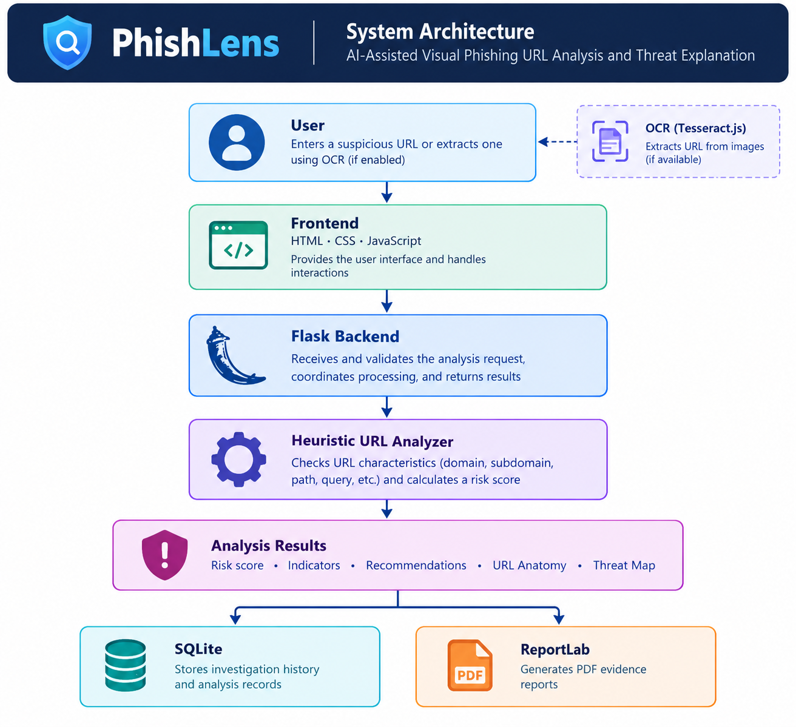
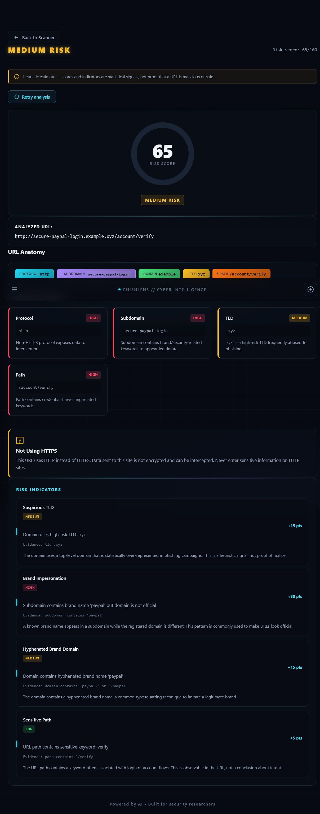

# PhishLens — AI-Assisted Visual Phishing URL Analysis and Threat Explanation

**OPCODE IMPACT 2026 | Hackathon Submission**

**Team ID:** OPC015

## 1. Problem Statement

Phishing attacks frequently exploit URL structure—subdomain spoofing, lookalike domains, misleading paths, URL shorteners, and embedded credentials—to deceive users into visiting malicious sites. Security analysts and end-users need a tool that breaks down a URL into its structural components, explains why each component is suspicious with concrete evidence, provides an explainable and capped risk score with per-indicator contributions, and performs all analysis statically without fetching or executing the target URL. Existing solutions often rely on external reputation APIs or machine-learning models that require network connectivity and offer limited explainability.

## 2. Solution Title

PhishLens — AI-Assisted Visual Phishing URL Analysis and Threat Explanation

## 3. Solution Description

PhishLens is a lightweight, self-contained web application that performs rule-based heuristic analysis of submitted URLs to identify phishing indicators. It delivers an explainable risk score (0–100) with a detailed breakdown of raw total, cap, final score, and per-indicator contributions. The interactive dashboard visualizes URL anatomy as clickable, keyboard-accessible color-coded pills and a component-level Threat Map that links detected indicators and structural anomalies to the selected URL component. Optional screenshot OCR extracts URLs from images using Tesseract.js. Investigation history is persisted locally in SQLite, and PDF evidence reports can be generated for any saved analysis. All analysis runs locally; no network requests are made to the analyzed URL at any point.

## 4. Architecture Diagram



The application follows a client-server architecture. The Flask backend exposes REST endpoints (`/api/analyze`, `/api/investigations`, `/api/investigations/<id>/report.pdf`, `/health`) and serves the single-page frontend. The core analyzer (`analyzer.py`) contains pure functions for URL parsing, indicator extraction, risk scoring, score breakdown, risk level determination, and recommendation generation—no I/O, no network calls. The investigations module (`investigations.py`) handles SQLite persistence with parameterized queries and URL credential redaction. The report module (`report.py`) uses ReportLab to generate PDF evidence reports. The frontend (`templates/index.html`, `static/app.js`, `static/style.css`) implements a cyber-intelligence themed dashboard with URL anatomy pills, Threat Map, risk ring, score breakdown, recommendations, and an Investigations tab. OCR runs client-side via Tesseract.js loaded from CDN on demand.

**Note:** The architecture diagram image file (`docs/architecture.png`) is not yet present in the repository and needs to be added.

## 5. Technology Stack

- **Frontend:** HTML5, CSS3 (custom properties, Inter/JetBrains Mono fonts, glassmorphism, responsive grid), Vanilla ES6+ JavaScript (no build step)
- **Backend:** Python 3.10+, Flask 3.0.3
- **Database:** SQLite (local file `instance/phishlens.db`, gitignored)
- **Other Technologies:** ReportLab 5.0.1 (PDF generation), pytest 8.3.3 (testing), Tesseract.js 5.x (client-side OCR, loaded from jsDelivr CDN)

## 6. Quick Start Guide

**Prerequisites:**
- Python 3.10 or newer
- Windows PowerShell 5.1+ or standard Bash shell
- Git (to clone the repository)

**Installation & Execution:**

```bash
# 1. Clone and enter the repository
git clone https://github.com/Gopiks-cyber/PhishLens-AI-assisted-visual-phishing-URL-analysis-and-threat-explanation.git
cd PhishLens-AI-assisted-visual-phishing-URL-analysis-and-threat-explanation

# 2. Create and activate a virtual environment
# Windows PowerShell:
python -m venv .venv
.venv\Scripts\Activate.ps1

# Bash (Linux/macOS/WSL/Git Bash):
python -m venv .venv
source .venv/bin/activate

# 3. Install dependencies
pip install -r requirements.txt

# 4. Start the Flask development server (default: http://localhost:5000)
python app.py

# 5. Open http://localhost:5000 in a browser
```

## 7. Output Screenshots



The PhishLens dashboard displays a dark-themed cyber-intelligence interface. The URL Scanner panel accepts a URL and optional screenshot upload. After analysis, the Overview panel shows the risk ring with score and level, the analyzed URL, interactive URL anatomy pills (with clickable subdomain segments), suspicious components, HTTPS note, and risk indicators with evidence. The Threat Map panel updates on pill selection to show matched indicators, structural anomalies, and score contributions for that component. The Risk Breakdown panel presents raw total, cap, final score, and per-indicator contribution bars. The Recommendations panel lists risk-level-based and indicator-specific guidance. The Investigations tab lists saved analyses with risk level, score, timestamp, and actions to open the stored result or download a PDF evidence report. All text uses safe DOM rendering to prevent XSS.

**Note:** The output screenshot image file (`docs/output.png`) is not yet present in the repository and needs to be added.

## 8. Future Scope

- Integrate live threat-intelligence feeds (e.g., PhishTank, URLhaus, OpenCTI) for reputation enrichment
- Add a trained machine-learning classifier as a complementary signal alongside rule-based heuristics
- Implement user authentication and role-based access for multi-user deployments
- Support scheduled batch analysis of URL lists with CSV/JSON export
- Extend OCR to detect QR codes and extract embedded URLs
- Add MITRE ATT&CK technique mapping for phishing indicators

## 9. Team Contributions

| Member Name | Contribution |
|-------------|--------------|
| Nikhitha M | Presentation and project demonstration |
| Gopikrishnan S | Backend development and API implementation |
| Nachikethass K Dhandapani | Frontend development and user interface |
| Amal Chandran P | Application testing and bug verification |

## 10. Tools Used

| Tool / Platform | Purpose / Why Used |
|-----------------|--------------------|
| Python 3.10+ | Core programming language for backend and analyzer logic |
| Flask 3.0.3 | Lightweight WSGI web framework for REST API and template rendering |
| SQLite | Zero-configuration local database for investigation persistence |
| ReportLab 5.0.1 | Pure-Python PDF generation for evidence reports |
| pytest 8.3.3 | Unit and integration testing (102 tests passing) |
| Tesseract.js 5.x | Client-side OCR for screenshot URL extraction (CDN-loaded) |
| Git / GitHub | Version control and repository hosting |
| Visual Studio Code | Primary IDE for development |
| Kilo (AI coding agent) | Assisted with code generation, refactoring, test writing, and debugging |
| Node.js | JavaScript syntax checking (`node --check`) for frontend files |